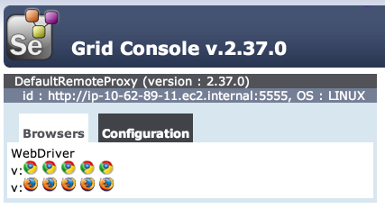

 Selenium Grid 
=============
Version 1.0-30p
---------------
Qubell Selenium Grid is an on-demand component for AWS that has been designed specifically for distributed cloud environments. It is:

- Simple to deploy and integrate
- Built to operate multiple machines concurrently (parallelization)
- Fully extendable with a single click

With Selenium Grid, you no longer need to rely on your local browser(s) for testing. It allows you to easily manage multiple environments from a central hub so you can run your tests against a vast combination of browsers and operating systems.

**To install Qubell Selenium Grid, just click the button below.**

[](https://express.qubell.com/applications/upload?metadataUrl=https://raw.github.com/qubell-bazaar/component-selenium-grid/master/meta.yml)

Requirements
------------
You must have an AWS cloud account capable of creating EC2 nodes. Configure the EC2 "default" security group to allow connections on the following ports:
- 22 (SSH)
- 4444 (Selenium Hub)

Quick Start
-----------
**IMPORTANT:** To use Selenium Grid with the Qubell platform, you need an AWS cloud account that is capable of creating EC2 nodes. Refer to *Requirements* above.

1. Install Selenium Grid by clicking  [](https://express.qubell.com/applications/upload?metadataUrl=https://raw.github.com/qubell-bazaar/component-selenium-grid/master/_resources/meta.yml).

2. Follow the on-screen instructions to add Selenium Grid to your organization within the Qubell Platform.

3. If you do not have an AWS cloud account, create one now and configure it per the *Requirements* stated above.

4. Confirm that *Cloud Account*, *Workflow Service* and *Secure Vault 2.0* are running as services for your environment (`Environments` >`{Your Platform}`>`Services`). To add these services, click the `Add a service...` button.

5. Navigate to `Components` and launch `Selenium Grid` (by clicking the play button).

6. If successful, you should see a remote URL and console URL set similar to those shown below.


7. Click the console URL. You should see a screen similar to that shown below.


Testing Your Installation
-------------------------
To confirm that Selenium Grid is working properly, install the Selenium binding using Terminal `sudo pip install selenium` 
and launch `python`.

``` python
>>> """Import"""
>>> from selenium import webdriver
>>> from selenium.webdriver.common.desired_capabilities import DesiredCapabilities

>>> remoteUrl = 'Use remote-url from grid instance here'
>>> driver = webdriver.Remote(
   command_executor=remoteUrl,
   desired_capabilities=DesiredCapabilities.CHROME)

>>> """Now open console-url"""
>>> """You should see that one Chrome icon is shaded"""
>>> """This is your allocated browser in the cloud"""

>>> """Let's check out what it can do"""
>>> driver.get("http://qubell.com")
>>> driver.title
u'Qubell - Adaptive Enterprise Platform-as-a-Service (PaaS)'

>>> "Congratulations, you're ready to use Selenium Grid"
```

Note that this test should take no more than 5 minutes to complete. If it exceeds 5 minutes, please contact [support@qubell.com](support@qubell.com).

About
--------------
Qubell Selenium Grid is set up and managed using [Chef Cookbooks](https://docs.getchef.com/essentials_cookbooks.html).
Currently, Selenium Grid supports [Selenium 2.0+ (WebDriver)](http://docs.seleniumhq.org/docs/03_webdriver.jsp) and is **NOT** backwards compatible with Selenium 1.0. It was tested on Ubuntu 12.04 LTS; however, other operating systems are supported.

Advanced Configuration
----------------------
The following advanced configuration options are available for Selenium Grid:

1. On start, you may reconfigure:
 - The Cookbooks URI
 - ``selenium version`` (2.0 and newer)
 - ``node count``

2. Under Environment Policies, you may override:
 - `selenium-provision.vmIdentity`
 - `selenium-provision.imageId`
 - `selenium-provision.hardwareId`
  
3. You may utilize the `restart` command to manually restart Selenium Grid.

FAQ
---
Q: What are Selenium and Grid?
 - A: Check out http://www.seleniumhq.org/projects/webdriver and https://code.google.com/p/selenium/wiki/Grid2 for more
 information.

Q: The example is in Python. Do you support other languages as well?
 - A: Selenium is a cross-platform tool, so other languages are supported. Please refer to 
 http://www.seleniumhq.org/download for more information.

Q: What browsers are supported?
 - A: Chrome and Firefox are fully supported and tested. We recommend connecting Internet Explorer (IE) and other browsers 
 as standalone nodes. For cross-browser testing, use Cloud Services.

Q: I'm interested in extending--what do you think?
 - A: Cool! Create a pull request or issue and we'll review and proccess it.
